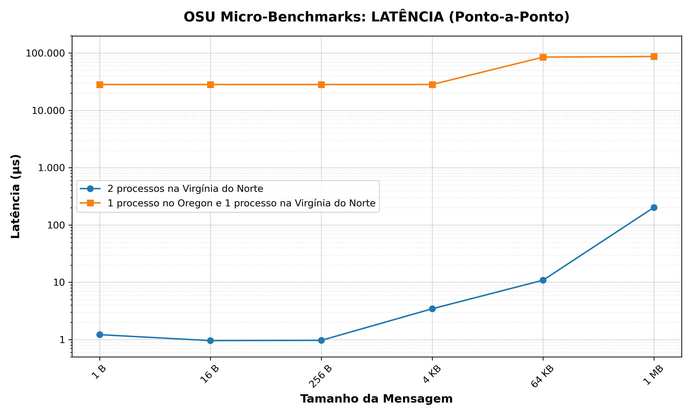

# Ambiente na Nuvem (AWS)

Este diretório contém as instruções e dados do laboratório em nuvem. Usamos a
AWS para medir a latência de comunicação entre dois processos MPI em cenários
diferentes: dentro de uma mesma máquina e entre duas máquinas em regiões
distantes.

## O que foi feito

Criamos duas instâncias `t2.micro` (1 vCPU, 1 GB de RAM) em regiões diferentes
dos EUA:

- **Virgínia do Norte** (`us-east-1`)
- **Oregon** (`us-west-2`)

A distância entre elas é de aproximadamente 4.000 km. Executamos o benchmark
`osu_latency`, que funciona no modelo ping-pong: um processo envia uma mensagem
(`MPI_Send`) e o outro devolve (`MPI_Recv`). O tempo reportado é a latência
unidirecional média (one-way), calculada a partir de 100 iterações para cada
tamanho de mensagem. Conforme a documentação oficial do OSU Micro-Benchmarks:
*"average one-way latency numbers are obtained"*
([README-OMB](https://mvapich.cse.ohio-state.edu/static/media/mvapich/README-OMB.txt)).

## Glossário de Componentes AWS

Para facilitar o entendimento, veja o que cada componente faz neste laboratório:

| Componente | O que é? | Função neste Laboratório |
| :--- | :--- | :--- |
| **VPC (Virtual Private Cloud)** | Rede privada isolada | Garante isolamento para o tráfego do MPI |
| **Subnet (Sub-rede)** | Divisão da VPC | Onde as instâncias são hospedadas |
| **Internet Gateway (IGW)** | Porta de entrada/saída | Permite seu acesso via SSH às instâncias |
| **Route Table** | Regras de tráfego | Direciona dados entre as regiões via Peering |
| **VPC Peering** | Conexão entre VPCs | Conecta Virgínia e Oregon de forma privada |
| **Security Group (SG)** | Firewall virtual | Libera portas TCP (MPI) e SSH (22) |
| **EC2 Instance** | Servidor virtual | São os nós do cluster onde o MPI roda |
| **CIDR** | Notação de faixa de IPs | Define quais IPs a rede usa (ex: 10.0.0.0/16 = IPs de 10.0.0.1 até 10.0.255.254). |

---

## Configuração de Infraestrutura (Passo a Passo)

### 1. VPC (Virtual Private Cloud)

Crie uma VPC em cada região com blocos CIDR distintos:

- **Virgínia:** `10.0.0.0/16`
- **Oregon:** `10.1.0.0/16`

Crie uma Subnet pública e um Internet Gateway anexado em cada região. A subnet
precisa ser pública para que você consiga acessar as instâncias por SSH. A
comunicação MPI entre as regiões passa pelo Peering (privado).

### 2. VPC Peering

1. Na Virgínia, solicite o **Peering Connection** para a VPC do Oregon.
2. No Oregon, aceite a solicitação.
3. **Rotas:** Em cada região, adicione uma rota na *Route Table* apontando o
   CIDR da outra região para o ID do Peering (`pcx-xxxx`).

### 3. Security Groups (Firewall)

Configure as regras de entrada:

- **SSH (Porta 22):** Liberado para o seu IP.
- **TCP (Portas 1024-65535):** Liberado para o CIDR da VPC oposta (ex: na
  Virgínia, libere para `10.1.0.0/16`).

### 4. Configuração das Instâncias (Amazon Linux 2023)

Instale as dependências após o acesso SSH:

```bash
sudo dnf update -y
sudo dnf install -y gcc gcc-c++ make openmpi openmpi-devel
echo 'export PATH=$PATH:/usr/lib64/openmpi/bin' >> ~/.bashrc
source ~/.bashrc
```

### 5. Chaves SSH

Gere a chave na Virgínia (`ssh-keygen`) e adicione a `id_rsa.pub` ao arquivo
`authorized_keys` no Oregon.

---

## Como rodar o teste

A execução é feita a partir da instância na Virgínia do Norte:

```bash
mpirun --hostfile hostfile_aws \
  --mca pml ob1 \
  --mca btl tcp,self \
  --mca btl_tcp_disable_family IPv6 \
  --map-by node -np 2 ./osu_latency
```

### Parâmetros:

- `--mca pml ob1`: Camada de mensagens ponto a ponto.
- `--mca btl tcp,self`: Usa TCP para rede e comunicação interna.
- `--mca btl_tcp_disable_family IPv6`: Desabilita IPv6.

## Resultados

| Cenário | Latência Mínima | Latência Máxima |
| :--- | :--- | :--- |
| **1. Local (Virgínia)** | 0,92 µs | 202,66 µs |
| **2. Inter-regional (Oregon)** | 28,27 ms | 87,17 ms |



## Dados e Scripts

Os dados estão em `dados/` e o script de geração de gráficos em `scripts/`.
